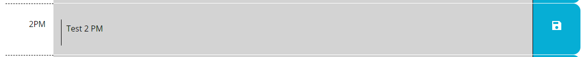
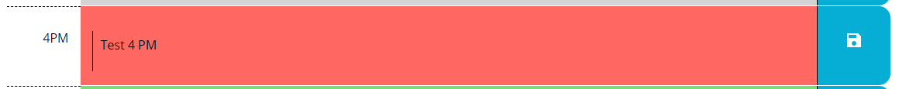
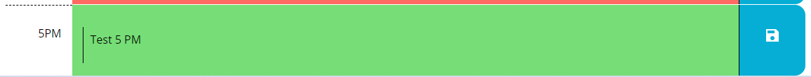

# Work Day Scheduler 

## Purpose
An application that allows a user to plan the activities of their work day.

## Website
https://brandonljackson23.github.io/daily-scheduler/

## Overview
The current date is displayed at the top of the page. The workday hours are set for 9:00 am to 6:00 pm. There is a timeslot for each hour that allows a user to save descriptions of events using the corresponding save button in the row.  Styling has been added to help the user quickly locate the current time of day.  Any hour in the past is displayed in gray, the present hour in red and any future hour in green.

## Features
Current Date
The current date uses moment.js to generate and updates automatically.

Updating Events
Each time slot contains a label for the designated hour along with a textarea that allows the user to enter/update an event and a save button to save the event to localStorage.  Saved events will also load from localStorage upon page load.

Dynamic Styling
To help a user easily recognize the current time of day each timeslot will dynamically update based on the curent time. Any hour in the past is displayed in gray:

The current hour is displayed in red:

Any future hour is displayed in green:

The page will reload at the top of every hour to ensure that styling reamins current.

